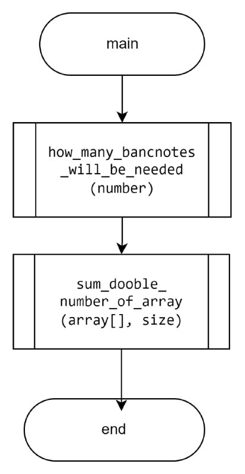
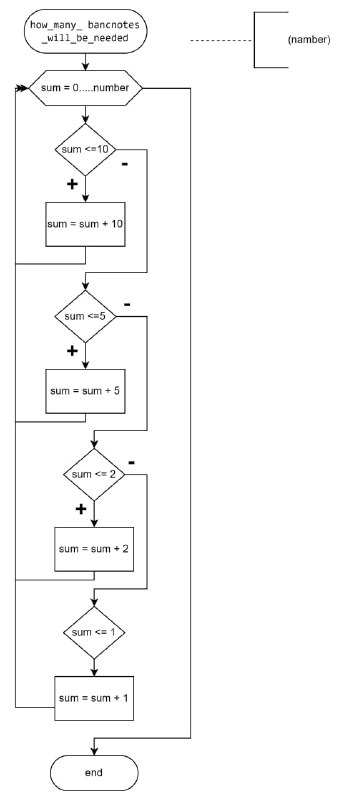
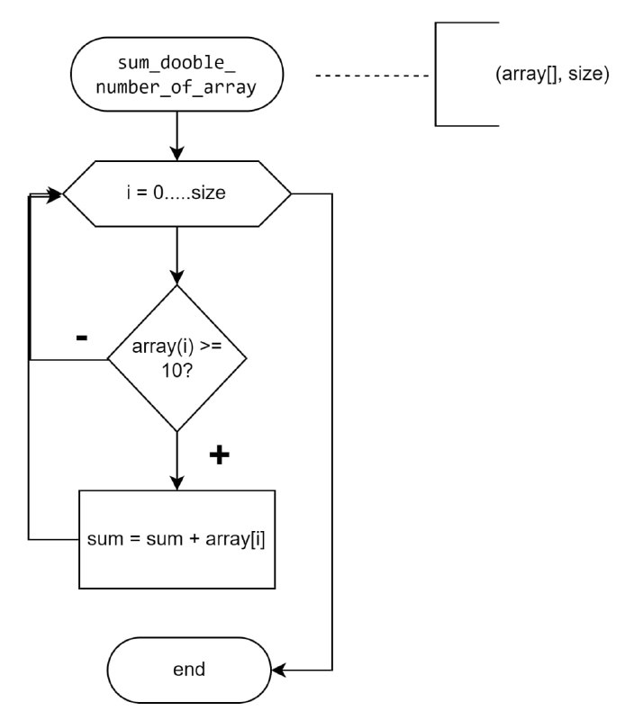

# Лабораторна робота №8 Вступ до документації проєкту

## Вимоги:

**Розробник**: Зябченко Іван КН-922а

**Завдання**: Розробити повноцінний звіти для лабораторної роботи "Функції", що присвячена функціям у двох форматів (+їх репрезентація у PDF форматі)

## Опис програми

### Функціональне призначення
Програма дає змогу визначити за схемою створеного алгоритму а)суму двоцифрових чисел масиву, б)за яку манамальну кількість купюр можна придбати на певну суму.

### Призначення та опис структури розроблених методів констант та змінних

**Макровизначення**
`#define ROZM 5`  розмір масиву (кількість стовпців) 

**Опис функцій**
`int main ( )` Точка входу в програму. Демонстрація рішення. Повертає: код помилки (0) 



`int how_many_bancnotes_will_be_needed( int number)`, скільки мінімально протрібно купюр для певної суми. 



**Аргументи**
- number -  дана сума S

**Повертає**
    Кількість купюр 

`int sum_dooble_number_of_array	( int array[], int size )`, визначає суму двозначних чисел у масиві



**Аргументи**
- array - даний масив для розрахунку
- size - розмір масиву

**Повертає**
    Сума двозначних цифр масиву 

### Структура прогами
```
.
├── doc
│   ├── assets
│   │   ├── function-main.png
│   │   ├── how_many_bancnotes_will_be_needed.png
│   │   └── sum_dooble_number_of_array.png
│   └── lab08.md
├── Doxyfile
├── Makefile
├── README.md
└── src
    └── main.c
```

### Варіанти використання

- результат можна побачити за допомогою відлагодника, зупинившись на `return 0;`, приклад виводу на екран:

```
(int[5]) my_array = ([0] = 34, [1] = 12, [2] = 24, [3] = 7, [4] = 4)
(int) sum = 70
(unsigned int) bancnotes = 5
```
## Висновки

На цій лабораторній роботі ми розібралися з форматами оформлення звіту Doxygen, та MarkDown. Розробили повноцінні звіти для лабораторної роботи "Функції", що присвячена функціям у двох формах.


